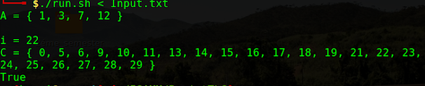

## This is a TLC project where we were asked to generate a compiler using FLEX and YACC.

###  Task

Write a syntax analyzer (flex + yacc) that validates and evaluates set expressions according to one of the 2 syntax versions.
The lexer is a preliminarily identical for both versions. Be sure to proceed in an iterative, step-by-step manner. For example:
+ Elimination of Blanks
+ Constants only
+ Parsing line by line Operation " Union " operation
+ Assignment and use of Variables
+ Functional version: " Union() " function with n arguments.
+ Same for " Inter() " Version
+ Operator: handling ambiguity: parentheses, associations, operator priority, syntax error handling and lexical errors.
+ ...

